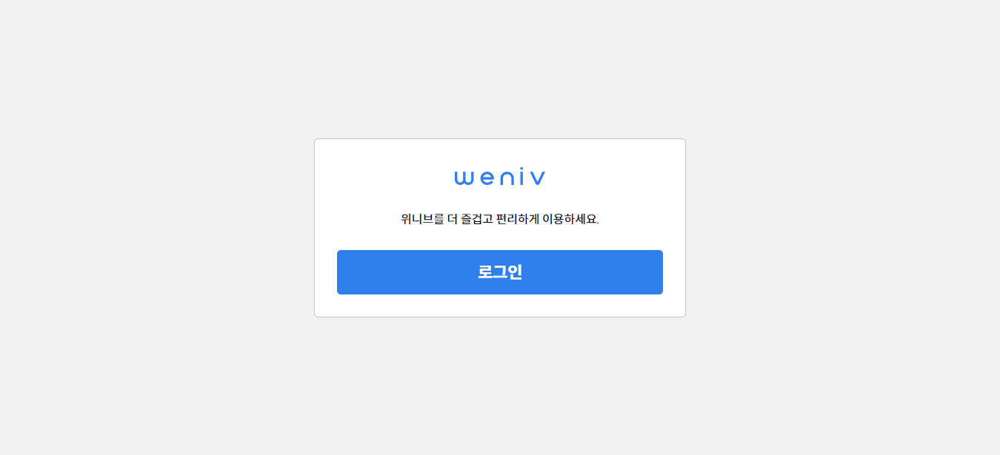

# Basic_layout

## Homepage

</img>
</img>
</img>
</img>

## Repository Description

첫 번째 페이지는 기능이 없는 기본 페이지입니다. github page를 통해 들어가면 제일 처음 보이는 페이지이기도 합니다. 두 번째 페이지의 login을 누르면 3번째 페이지로 이동됩니다. 또한 3번째 페이지의 아이디와 비밀번호를 입력한 후 로그인을 누르면 마지막 페이지로 이동합니다. dropbox의 경우 hover 때, 마우스의 모양을 다르게 보이게 만들었습니다.